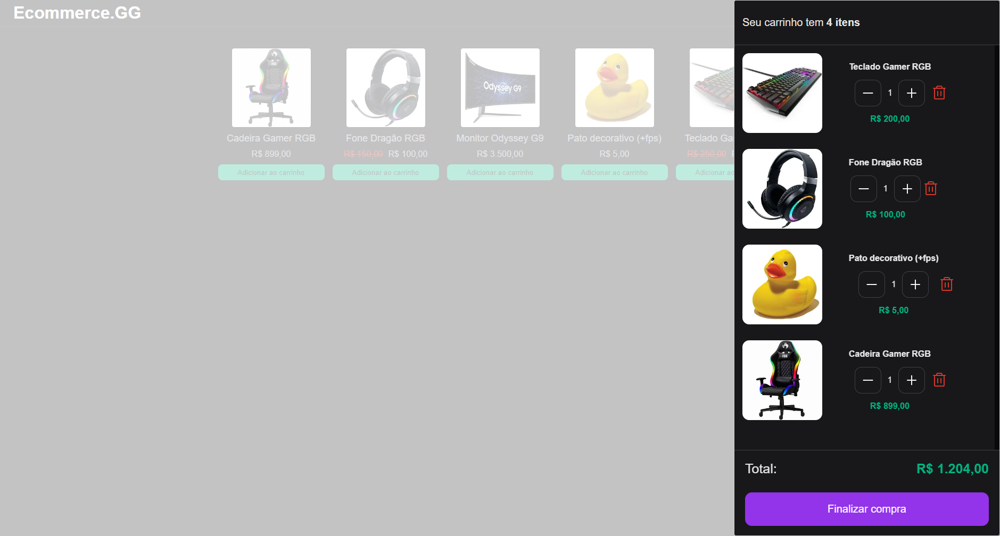

# Ecommerce.GG
## Sobre o projeto

Desenvolvi um site de ecommerce para aplicar meus conhecimentos no gerenciamento de estado REDUX, criei uma API local pelo my-json-server e coloquei alguns produtos ficticios para fazer chamadas HTTP em minha aplicação.
A intenção desse projeto é colocar em prática meus conhecimentos em REDUX e gerenciamento de estado
## Imagens do Site

### Home

### Mini Cart

### Checkout

## Tecnologias Usadas

 * ReactJS
 * NextJS
 * Typescript
 * Scss
 * Redux
 * Axios
